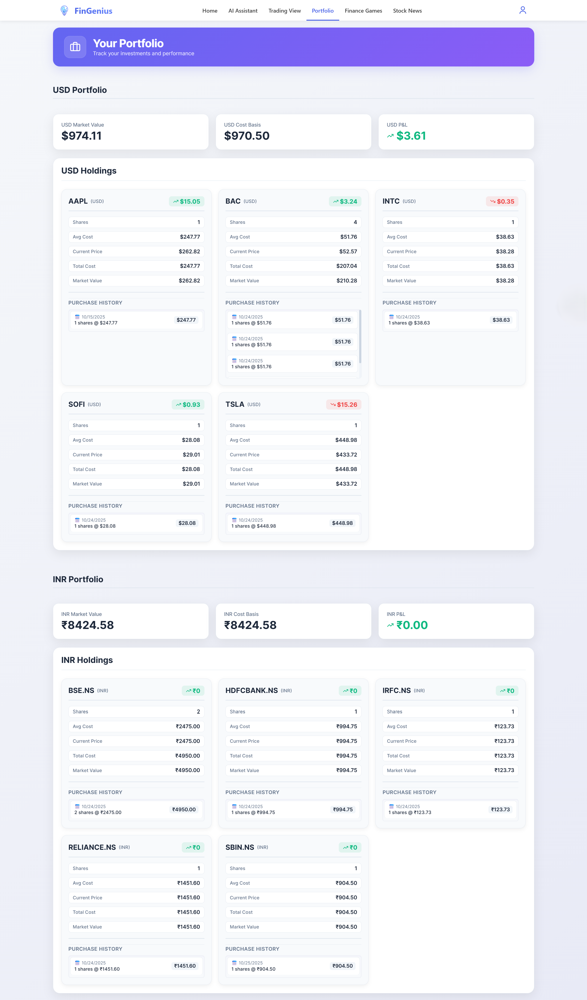

# FinGenius 🚀

> Your AI-powered financial assistant for smart investing and portfolio management

[](https://reactjs.org/)
[](https://flask.palletsprojects.com/)
[](https://tailwindcss.com/)
[](LICENSE)

## 📋 Table of Contents

- [Overview](#overview)
- [Features](#features)
- [Tech Stack](#tech-stack)
- [Project Structure](#project-structure)
- [Getting Started](#getting-started)
  - [Prerequisites](#prerequisites)
  - [Installation](#installation)
  - [Running the Application](#running-the-application)
- [API Endpoints](#api-endpoints)
- [Usage](#usage)
- [Screenshots](#screenshots)
- [Contributing](#contributing)
- [License](#license)

## 🌟 Overview

**FinGenius** is a comprehensive financial platform that combines AI-powered insights, real-time market data, and interactive learning tools to help users make informed investment decisions. The platform features an intelligent chatbot, advanced trading views, portfolio management, market news analysis, and educational finance games.

## ✨ Features

### 🤖 AI Financial Assistant
- **Personalized Advice**: Get AI-powered financial recommendations tailored to your portfolio
- **Real-time Analysis**: Instant market insights and trend analysis
- **Portfolio Optimization**: Smart suggestions to improve your investment strategy
- **Natural Language Processing**: Ask questions in plain English and get detailed responses

### 📊 Advanced Trading View
- **Live Market Data**: Real-time stock prices and market indicators
- **Technical Analysis**: Professional-grade charting tools
- **Multi-timeframe Analysis**: View data across different time periods
- **Custom Alerts**: Set up notifications for price movements

### 📰 Market News & Insights
- **Curated News Feed**: Latest financial news from Google News RSS
- **Sentiment Analysis**: AI-powered analysis of market sentiment
- **Stock-specific News**: Get news for specific tickers (supports Indian stocks with .NS/.BO suffixes)
- **Batch Processing**: Fetch news for multiple stocks simultaneously

### 🎮 Interactive Finance Games
- **Budget Game**: Learn budgeting and financial planning
- **Escape Room**: Solve financial puzzles and challenges
- **Fake or Finance**: Test your knowledge of financial facts

### 💼 Portfolio Management
- **Real-time Tracking**: Monitor your investments in real-time
- **Performance Analytics**: Detailed insights into portfolio performance
- **Risk Assessment**: Understand your investment risk profile

## 🛠️ Tech Stack

### Frontend
- **React** (18.3.1) - UI framework
- **React Router** (7.1.5) - Navigation and routing
- **TailwindCSS** (4.0.6) - Utility-first CSS framework
- **shadcn/ui** - Modern UI components
- **Lucide React** - Beautiful icon library
- **Axios** - HTTP client for API requests
- **React Markdown** - Markdown rendering with syntax highlighting
- **Socket.io Client** (4.8.1) - Real-time communication

### Backend
- **Flask** (2.3.0) - Python web framework
- **Flask-CORS** (4.0.0) - Cross-Origin Resource Sharing
- **Feedparser** (6.0.10) - RSS feed parsing for news

### Additional Libraries
- **@radix-ui/react-slot** - Primitive UI components
- **class-variance-authority** - CSS class management
- **rehype-highlight** - Syntax highlighting for code blocks
- **remark-gfm** - GitHub Flavored Markdown support

## 📁 Project Structure

```
FinGenius/
├── my-frontend/                 # React frontend application
│   ├── public/                  # Static assets
│   ├── src/
│   │   ├── assets/              # Images, logos, and static files
│   │   ├── components/          # React components
│   │   │   ├── AuthPage/        # Authentication components
│   │   │   ├── Chat/            # Chat interface
│   │   │   ├── HomePage/        # Main landing page
│   │   │   ├── NAVBAR/          # Navigation bar
│   │   │   ├── Portfolio/       # Portfolio management
│   │   │   ├── StockNews/       # News feed component
│   │   │   └── TradingView/     # Trading charts and data
│   │   ├── context/             # React context providers
│   │   │   └── AuthContext.js   # Authentication state management
│   │   ├── game/                # Game routing logic
│   │   ├── pages/               # Page components
│   │   │   ├── BudgetGame.jsx   # Budget management game
│   │   │   ├── EscapeRoom.jsx   # Financial escape room
│   │   │   ├── FakeOrFinance.jsx # Quiz game
│   │   │   └── GamesPage.jsx    # Games hub
│   │   ├── services/            # API service layer
│   │   │   └── chatService.js   # Chat API integration
│   │   ├── styles/              # Global styles and CSS
│   │   ├── App.js               # Main application component
│   │   └── index.js             # Application entry point
│   ├── package.json             # Frontend dependencies
│   └── .gitignore               # Git ignore rules
├── backend_news_proxy.py        # Flask backend for news API
├── requirements_news.txt        # Python dependencies
└── README.md                    # Project documentation

```

## 🚀 Getting Started

### Prerequisites

Before you begin, ensure you have the following installed:
- **Node.js** (v14 or higher)
- **npm** or **yarn**
- **Python** (3.8 or higher)
- **pip** (Python package manager)

### Installation

1. **Clone the repository**
   ```bash
   git clone https://github.com/yourusername/FinGenius.git
   cd FinGenius
   ```

2. **Install Frontend Dependencies**
   ```bash
   cd my-frontend
   npm install
   ```

3. **Install Backend Dependencies**
   ```bash
   cd ..
   pip install -r requirements_news.txt
   ```

### Running the Application

#### Start the Backend Server

The backend provides news fetching and sentiment analysis services.

```bash
python backend_news_proxy.py
```

The Flask server will start on `http://localhost:5001`

**Available Endpoints:**
- `GET /api/news/<ticker>` - Get news for a single ticker
- `POST /api/news/batch` - Get news for multiple tickers
- `GET /health` - Health check endpoint

#### Start the Frontend Application

```bash
cd my-frontend
npm start
```

The React application will start on `http://localhost:3000`

## 🔌 API Endpoints

### News Proxy API (Port 5001)

#### Get News for Single Ticker
```http
GET /api/news/<ticker>?limit=25
```

**Example:**
```bash
curl http://localhost:5001/api/news/RELIANCE.NS?limit=10
```

**Response:**
```json
{
  "ticker": "RELIANCE.NS",
  "company_name": "RELIANCE",
  "news": {
    "headlines": ["..."],
    "sources": ["..."],
    "dates": ["..."],
    "links": ["..."],
    "count": 10
  },
  "success": true
}
```

#### Get News for Multiple Tickers
```http
POST /api/news/batch
Content-Type: application/json

{
  "tickers": ["RELIANCE.NS", "TCS.NS", "INFY.NS"],
  "limit": 10
}
```

### Main Backend API (ngrok endpoint)

The application connects to a main backend API hosted at:
```
https://rapid-grossly-raven.ngrok-free.app
```

**Key Endpoints:**
- `/gemini/ask` - AI assistant queries
- `/trade/portfolio` - Portfolio management
- `/chat/start` - Start chat session
- `/chat/message` - Send chat message
- `/chat/end` - End chat session

## 💡 Usage

### Authentication
1. Navigate to the application at `http://localhost:3000`
2. Sign up for a new account or log in with existing credentials
3. Your authentication token will be stored securely

### Using the AI Assistant
1. Click on the **AI Assistant** tab or the floating chat button
2. Type your financial question or request
3. The AI will analyze your portfolio and provide personalized recommendations

### Viewing Market News
1. Navigate to the **Stock News** section
2. Search for specific stock tickers
3. View curated news with sentiment analysis

### Trading View
1. Access the **Trading View** tab
2. Search for stocks and view real-time charts
3. Use technical indicators for analysis

### Playing Finance Games
1. Go to the **Finance Games** section
2. Choose from Budget Game, Escape Room, or Fake or Finance
3. Learn financial concepts through interactive gameplay

## 📸 Screenshots

### Landing Page
The modern, intuitive homepage with AI-powered features and market indicators.


### Authentication
Secure login and signup with a beautiful, user-friendly interface.


### AI Financial Assistant
Get personalized financial advice and portfolio analysis powered by advanced AI.


### Portfolio Management
Track your investments in real-time with detailed analytics and performance metrics.



### Paper Trading Platform
Practice trading with real-time market data and advanced charting tools.


### Stock News & Sentiment Analysis
AI-powered news analysis with sentiment scoring for your portfolio stocks.


## 🤝 Contributing

Contributions are welcome! Please follow these steps:

1. Fork the repository
2. Create a new branch (`git checkout -b feature/amazing-feature`)
3. Commit your changes (`git commit -m 'Add some amazing feature'`)
4. Push to the branch (`git push origin feature/amazing-feature`)
5. Open a Pull Request

## 📄 License

This project is licensed under the MIT License - see the [LICENSE](LICENSE) file for details.

## 👥 Authors

- **Your Name** - *Initial work*

## 🙏 Acknowledgments

- Google News RSS for news data
- OpenAI/Gemini for AI capabilities
- TradingView for charting inspiration
- shadcn/ui for beautiful components

## 📞 Support

For support, email support@fingenius.com or open an issue in the repository.

---

**Made with ❤️ by the FinGenius Team**
